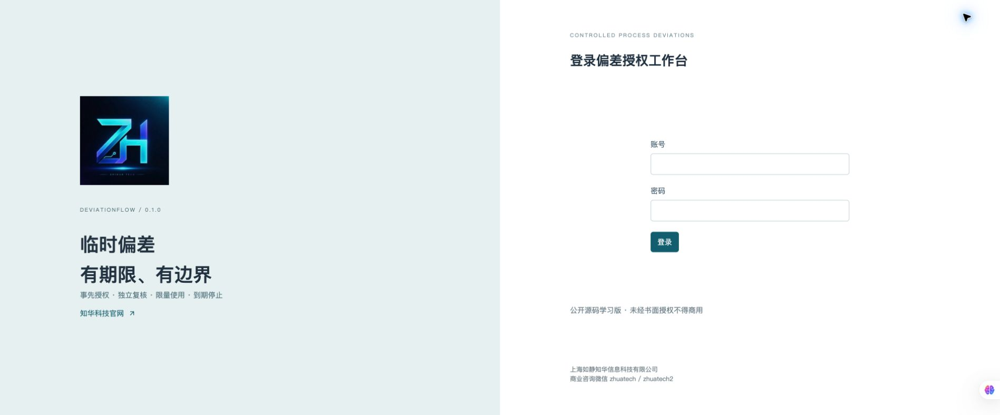
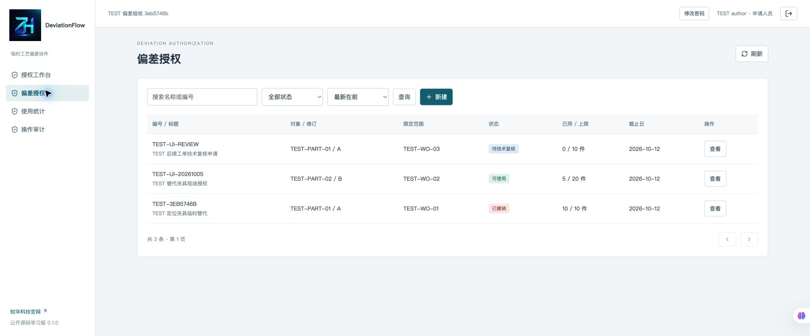
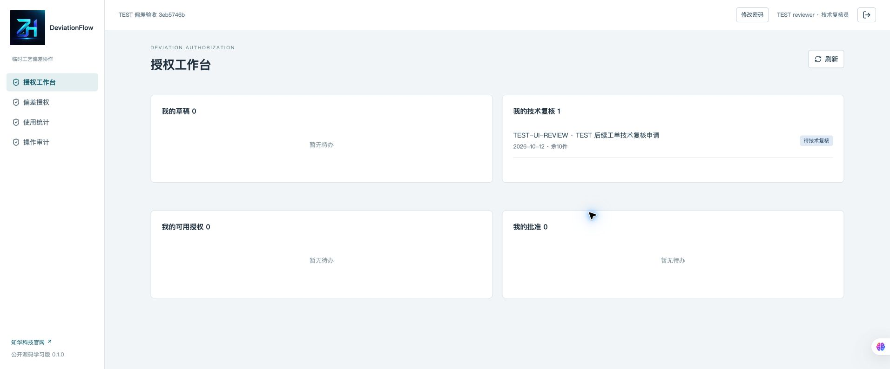
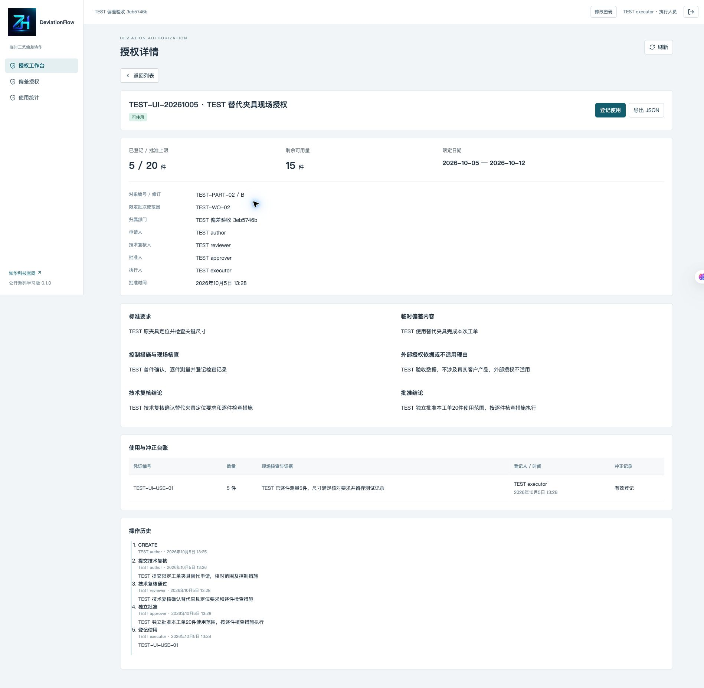
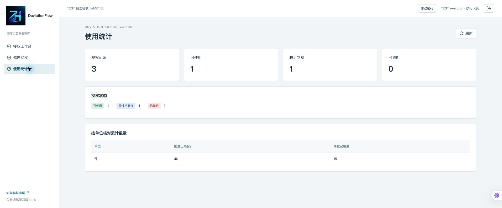
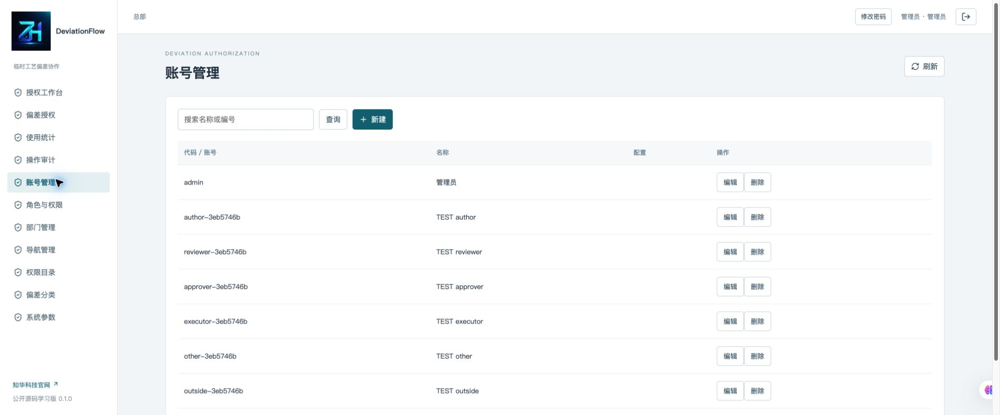
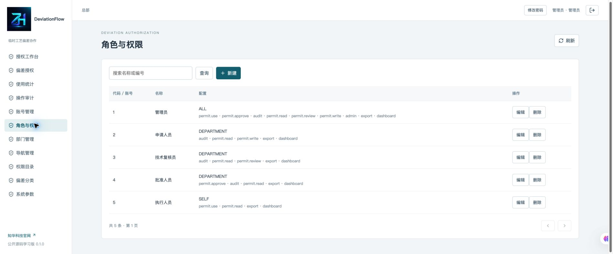

[中文](README.md) | [English](README.en.md)

<p align="center"></p>

# DeviationFlow · 临时工艺偏差授权与使用台账

**知华科技（上海如静知华信息科技有限公司）**
官网：<https://www.zhuatech.cn/> · 商业咨询微信：**zhuatech / zhuatech2**

**公开源码学习版／非商业源码版，未经书面授权不得商用。** 自有代码适用 [ZhuaTech Non-Commercial Source License 1.0](LICENSE)，不是 OSI 开源许可证。商业授权、定制开发、部署和系统集成请联系知华科技。第三方组件保留各自许可，见 [第三方声明](THIRD_PARTY_NOTICES.md)。

## 解决什么问题

原工装临时不可用、局部工艺需要暂时调整时，偏差应先说明范围、风险控制和外部授权依据，再由技术人员复核、独立人员批准。执行时必须匹配物料、修订和工单范围，不能超过日期或数量边界。

采用 Java 21、Spring Boot、Vue 3、MySQL 与 Flyway，DeviationFlow 将这条流程落实为可运行的 Web 应用：**申请 → 技术复核 → 独立批准 → 限期限量使用 → 独立冲正／撤销／关闭**。适用于学习内部临时工艺授权的分工与台账实现；不承担现场安全决策、合规认证或客户审批效力判断。

### 与其他系统的边界

- 不合格品处置、返工、报废和纠正措施通常属于 QMS；本项目管理事先批准的临时工艺偏差及逐次使用。
- 永久产品／BOM 变更属于 PLM／ECN；本项目不修改正式版本，不自动转为永久变更。
- 本项目拒绝不符合边界的**登记请求**；没有连接 MES、ERP 或设备，不能阻止现场实际生产。外部授权字段由负责人填入有效引用或“不适用”依据，系统不核验外部审批真实性。

## 已实现功能

| 模块 | 行为 |
| --- | --- |
| 账号与权限 | 会话登录、退出、修改密码；账号、角色、权限、菜单、部门、字典和参数管理；ALL／DEPARTMENT／SELF 数据范围 |
| 草稿与申请 | 分类、责任人、物料及修订、工单范围、原要求、偏差、控制措施、外部授权依据；仅作者编辑草稿 |
| 独立审批 | 作者、技术复核人、批准人三者不同；指定岗位处理；管理员不能替代指定业务人员审批 |
| 冻结授权 | 批准后冻结边界；按上海日期判断尚未生效、有效、到期、额度用尽；有效期最多包含 365 个自然日 |
| 使用台账 | 仅指定执行人登记；服务端核验对象／修订／范围、日期、整数数量、当前权限；独立使用凭据去重 |
| 冲正与终结 | 批准人独立冲正误登记，保留原数量、人员、日期和理由；撤销／关闭后不能登记或冲正 |
| 工作台与统计 | 本人待办、搜索、状态筛选、数据库分页、数量按单位分别统计、到期提示 |
| 导出与追溯 | 按相同权限范围导出单个授权 JSON，含使用与事件；审计、业务事件、持久化与版本控制 |

未实现：附件上传、电子签名、邮件／短信通知、ERP／MES 对接、客户在线审批、设备联锁、多企业租户和自动永久变更。本版本不包含 AI、支付、第三方在线服务或预置业务案例。截图中的 `TEST` 记录是验收数据，空库启动不生成这些记录。

## 当前运行页面

### 1. 登录
账号登录入口，通过服务端会话认证。



### 2. 申请人员授权列表
申请人员查询授权状态、物料修订、范围、日期和数量边界。



### 3. 技术复核人员工作台
指定技术复核人员查看本人待办，按职责复核控制措施与申请事实。



### 4. 指定执行人使用与额度详情
指定执行人员登记实际使用，查看净用量和保留的原始及冲正记录。



### 5. 授权统计
按授权范围和单位分别汇总额度、净使用及授权状态，不混加不同单位。



### 6. 系统账号管理
管理员维护岗位、部门与启停；业务审批仍须指定人员完成。



### 7. 角色与数据范围
配置注册权限和 ALL／DEPARTMENT／SELF 数据范围，服务端独立执行。



## 技术架构与目录

浏览器 → Nginx → Spring Boot → MySQL。业务写入、额度扣减、事件和幂等记录在同一事务提交；数据库悲观锁串行化写操作，实体版本防止旧页面覆盖。迁移由 Flyway 校验，运行时禁止自动建表。前后端独立构建，容器使用非 root 账号。

```text
backend/                      Java API、权限与事务、单元和接口集成测试
  src/main/resources/db/migration/  V1 身份目录、V2 授权与使用台账
frontend/                     Vue 操作页面、请求封装和前端测试
  public/brand/                正式 LOGO
  public/third-party/          第三方许可文本
scripts/                      本地配置生成、HTTP 验收和发布检查
compose.yaml                  MySQL、后端、前端隔离部署
.env.example                  配置名称，不含密码
LICENSE                       自有代码非商业许可
THIRD_PARTY_NOTICES.md         第三方组件说明
```

### 运行版本

- Java **21**、Maven **3.9**、Spring Boot **4.0.7**。
- Node.js **24.19 或以上**、npm **11**、Vue **3.5.40**、Vite **8.1.5**。
- MySQL **8.4**（MySQL 8 系列）、Flyway 版本由 Spring Boot 管理。
- Docker Engine 与 Docker Compose v2，Python **3.11 或以上**用于脚本。
- 依赖具体版本以 `backend/pom.xml` 与 `frontend/package-lock.json` 为准。

## 快速启动

```bash
python3 scripts/init-env.py
docker compose -p deviationflow-local config --quiet
docker compose -p deviationflow-local up --build -d --wait
```

访问 <http://127.0.0.1:8116/>。首个空库仅创建 `admin` 管理员和岗位目录；密码在本地 `.env` 的 `ADMIN_PASSWORD` 中。没有公开通用初始密码。配置生成脚本创建权限为 0600 的文件，拒绝覆盖已有配置。`.env` 不纳入 Git。

管理员先创建部门及申请、技术复核、批准、执行账号，再按 [操作手册](docs/OPERATIONS.md) 分工处理。不要将同一个人注册成多个账号绕过独立性要求。数据库非空时启动不重置密码；已有库改变 `.env` 的 `ADMIN_PASSWORD` 不会重设管理员，应由管理页面修改密码。

### 配置

| 名称 | 用途 |
| --- | --- |
| DATABASE_PASSWORD | 应用数据库账号密码，与 MySQL 一致 |
| MYSQL_ROOT_PASSWORD | MySQL 初始化管理密码，仅数据库容器使用 |
| ADMIN_PASSWORD | 空库管理员初始化密码 |
| WEB_PORT | 本地端口，默认 8116 |
| BIND_ADDRESS | 默认 127.0.0.1，限制本机访问 |
| COOKIE_SECURE | 本机 HTTP 为 false；HTTPS 部署设为 true |

密码至少 12 个字符，含大写、小写和数字，UTF-8 编码不超过 72 字节。配置文件、备份和验收状态必须私有保存。

### 分别启动开发环境

```bash
# 先通过 Compose 启动完整本地基础设施，或自行准备独立 MySQL。
cd backend
mvn spotless:check test package
mvn spring-boot:run
```

另一个终端从仓库根目录启动前端：

```bash
cd frontend
npm ci
npm run dev
```

单独后端需要设置 `DATABASE_URL`、`DATABASE_USER`、`DATABASE_PASSWORD`、`ADMIN_PASSWORD`，默认 JDBC 地址使用 Compose 内部主机 `mysql`。不要对外发布 MySQL 端口；开发连接可使用独立环境或受限隧道。前端开发代理配置见 `frontend/vite.config.js`。

## 数据库与部署

MySQL 的 `mysql-data` 命名卷持久化账号、授权、使用和事件。`V1__identity.sql` 建立账号和权限目录，`V2__deviations.sql` 建立授权、使用、事件和幂等记录，含外键和唯一约束。Flyway 首次启动迁移、后续校验；不要改写已执行迁移或删卷升级。

```bash
docker compose -p deviationflow-local ps
docker compose -p deviationflow-local logs --tail=100 backend
docker compose -p deviationflow-local down
```

主动重启时先重启 MySQL 并等待健康，再重启后端并等待健康，最后重启前端，使其代理解析当前后端地址。普通 `down` 保留数据卷。`down -v` 仅用于明确允许丢弃的测试库。正式部署应使用独立数据库和账号、HTTPS 反向代理、`COOKIE_SECURE=true`、访问控制、离线备份与恢复演练。修改监听范围前确认网络边界。详见 [部署](docs/DEPLOYMENT.md)、[数据库](docs/DATABASE.md)、[安全](docs/SECURITY.md)。

## 安全与数据范围

密码 BCrypt 保存，会话 HttpOnly、SameSite=Strict、30 分钟超时，写入需 CSRF 请求头；连续登录失败限流。禁用账号、密码变更、岗位权限及部门变更由服务端实时检查。ALL 可查看全库，DEPARTMENT 查看本部门，SELF 仅本人被指定或创建的授权；SELF 不能申请或审批，导出与详情使用同一范围。

客户端不能指定累计量、批准时间、使用人员或冲正时间。重复请求使用 UUID 幂等键；同键不同内容冲突。授权代码与使用凭据统一为大写，同授权内凭据唯一。数据库管理员仍可直接改变数据，当前审计不是加密签名或不可篡改存证。

## 测试与验收

```bash
cd backend
mvn spotless:check test package
cd ../frontend
npm ci
npm run format:check
npm run lint
npm test
npm run build
cd ..
docker compose -p deviationflow-check config --quiet
docker compose -p deviationflow-check up --build -d --wait
python3 scripts/smoke.py
python3 scripts/smoke.py --verify
python3 scripts/release-check.py
```

后端测试覆盖三人独立、指定执行、冻结边界、退回留痕、版本、幂等、重复凭据回滚、数量、日期、并发、部门和本人隔离、导出、权限变更及 CSRF。前端测试覆盖状态与请求封装。HTTP 验收针对真实 MySQL 和 HTTP 会话，创建明确标记的 `TEST` 数据；`--verify` 用于容器重启后核对持久化。只在专用测试数据库运行 `smoke.py`，其私有 `.smoke-state.json` 含随机测试账号密码，不上传。

镜像构建会执行格式、测试及前端构建，Maven 不跳过测试。发布检查验证品牌原图、二维码、LICENSE、README 图片、署名及常见敏感模式；不能代替人工差异和安全审查。详见 [测试说明](docs/TESTING.md)。

## 常见问题

- **启动失败**：先检查 Compose 服务状态和后端日志；数据库健康后仍失败时检查密码一致、迁移校验与字段类型。不要通过删除已有生产卷解决迁移错误。
- **401／登录失效**：重新登录；管理员检查账号是否禁用、密码是否已修改。
- **403**：检查岗位权限、数据范围、指定责任人和 CSRF；管理员不能替代指定审批人。
- **409**：刷新详情后核对状态、额度和版本；不要重复登记同一个凭据。相同幂等键须保持原请求内容。
- **使用被拒绝**：核对上海日期、额度、物料、修订、范围，以及执行人当前部门和岗位；终结授权不能重新打开。
- **数量格式**：只支持整数件、批、套；按单位统计，不混合累加。需要小数或质量单位时应调整数据库、校验与测试后另行版本发布。

## 参与与授权

欢迎提交可复现的问题、测试和小范围修复。请保留品牌、版权和许可声明；不要提交客户资料、账号密码或真实业务数据。提交前运行格式、测试、构建，数据库变更新增迁移，说明行为变化。贡献须具有合法授权，与自有代码许可兼容。

## 联系知华科技

商业授权或深度定制开发请联系知华科技。

**上海如静知华信息科技有限公司**
官网：<https://www.zhuatech.cn/>
商业授权、定制开发、部署与系统集成咨询微信：**zhuatech / zhuatech2**。

| 微信 zhuatech | 微信 zhuatech2 |
| --- | --- |
|  |  |
